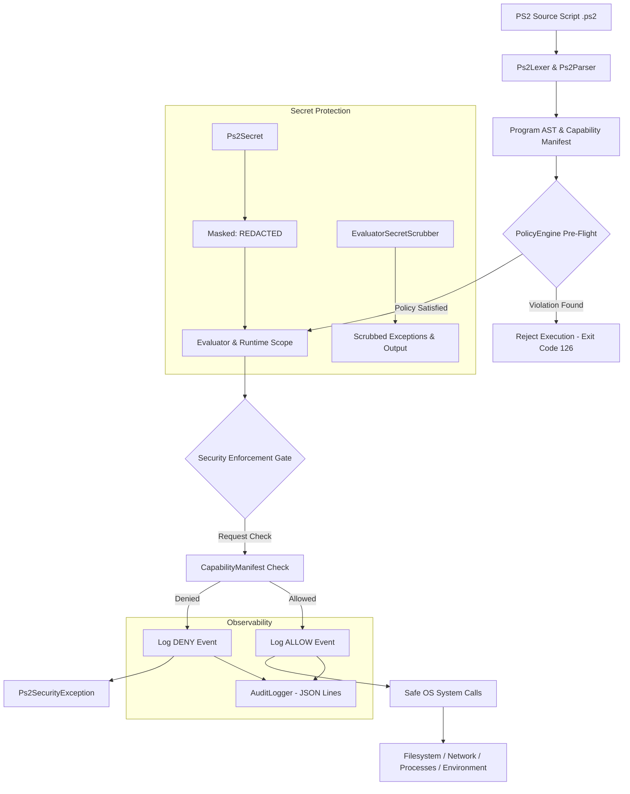
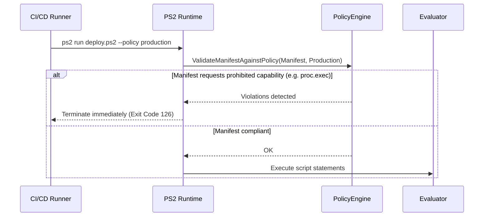

# PS2 Security & Runtime Architecture

PS2 is a **Secure Automation Runtime** engineered from the ground up for zero-trust infrastructure automation, CI/CD pipelines, and DevOps workflows. Unlike conventional scripting languages (PowerShell, Bash, Python) where scripts run with the full privileges of the host process, PS2 enforces an uncompromising **Default-Deny** capability security boundary.

---

## 1. High-Level Architecture & Security Boundary



### The Enforcement Invariant
The security boundary in PS2 is not merely syntax sugar; it sits at the lowest runtime abstraction layer directly wrapping OS system calls (`System.IO`, `System.Net.Http`, `System.Diagnostics.Process`, `System.Environment`). Even if malicious code constructs strings dynamically or uses indirect evaluation, it cannot bypass the runtime enforcement gate.

---

## 2. Core Security Pillars

### 1. Default-Deny Capabilities
Every script starts with zero privileges. Any operation touching an external boundary must be explicitly declared in the `#manifest` header:

```ps2
#manifest
requires {
    version: "1.0",
    fs.read: ["./config", "./data"],
    fs.write: ["./out"],
    net.http: ["api.github.com"],
    env: ["GITHUB_TOKEN"],
    proc.exec: ["git"]
}
#endmanifest
```

- **Filesystem Read/Write (`fs.read`, `fs.write`)**: Restricts filesystem access to explicit canonical paths or directory subtrees. Defends against path traversal (`../`), symlink redirections, and Windows Alternate Data Streams (`::$DATA`).
- **Network Access (`net.http`)**: Restricts outbound network communication to declared hostnames or wildcard domains (`*.company.com`). Redirects across hosts are inspected on every hop.
- **Environment Variables (`env`)**: Prevents untrusted scripts from reading sensitive environment credentials like `AWS_SECRET_ACCESS_KEY` unless explicitly authorized.
- **Process Execution (`proc.exec`)**: Restricts execution of external executables to an authorized binary allowlist. Arguments are passed as discrete token arrays (`ArgumentList`) to prevent shell injection (`cmd.exe /c` or `; rm -rf /`).

---

### 2. Organizational Policy Engine (`SecurityPolicy`)

While developers declare required capabilities in their scripts, DevOps and Security Teams define **Security Policies** that enforce organization-wide boundaries across entire clusters or CI/CD pipelines.

The `PolicyEngine` performs **pre-flight validation** before evaluating any statement:



#### Built-in Profiles
1. **`default`**: Standard Zero-Trust sandbox enforcing manifest declarations.
2. **`strict`**: Enforces signed scripts (`#signature:`) and blocks sensitive operating system configuration files.
3. **`production`**: Hardened production posture:
   - Process execution (`proc.exec`) is strictly forbidden.
   - External network access is blocked (only whitelisted internal hosts permitted).
   - Core system paths (`/etc`, `/root`, `C:/Windows`, `C:/Program Files`) are completely blocked from write operations.
   - Critical credentials (`AWS_SECRET_ACCESS_KEY`, `AZURE_CLIENT_SECRET`) are blocked from retrieval.

#### Custom Policy via JSON
Organizations can define declarative JSON policies:
```json
{
  "name": "corporate-ci-policy",
  "disallowProcessExecution": true,
  "disallowExternalNetwork": false,
  "allowedDomains": ["github.com", "api.github.com", "*.artifactory.internal"],
  "blockedPaths": ["/etc/shadow", "C:/Windows/System32/config"]
}
```
Enforce in CI/CD:
```bash
ps2 run build.ps2 --policy ./corporate-ci-policy.json
```

---

### 3. Structured Audit Logging

For SOC2, ISO 27001, and compliance auditing, PS2 produces high-throughput structured JSON audit logs recording every authorization attempt:

```json
{"timestamp":"2026-09-25T16:55:00.123Z","script_identity":"deploy.ps2","operation":"fs.read","resource":"/app/config.json","decision":"ALLOW","reason":"Capability granted by manifest"}
{"timestamp":"2026-09-25T16:55:00.125Z","script_identity":"deploy.ps2","operation":"proc.exec","resource":"curl","decision":"DENY","reason":"Missing capability declaration in manifest"}
```

Audit trails can be written to disk with `--audit-log <path>`:
```bash
ps2 run deploy.ps2 --audit-log /var/log/ps2/audit.jsonl
```

---

### 4. Secret Hygiene & Redaction Guarantees

In modern automation, credentials often leak via logs, error stack traces, or console output. PS2 introduces native secret types:

1. **`Ps2Secret`**: Acquired via `sys.secret("TOKEN_NAME")` or masked via `secret.mask(val)`.
2. **Always Redacted**:
   - Calling `println(secret)` prints `[REDACTED]`.
   - Serializing into JSON (`json.stringify(obj)`) emits `"[REDACTED]"`.
   - Unmasking is explicit via `secret.reveal(secret)`.
3. **`EvaluatorSecretScrubber`**:
   - All active secrets in a session are tracked in an execution-scoped scrubber.
   - Any runtime exception or stack trace message automatically replaces secret values with `[REDACTED]`.
   - Audit logs record the variable or resource name, never the raw secret value.

---

## 3. Comparison with Conventional Scripting

| Security Feature | PS2 (v0.3.0-beta) | Bash / Shell | PowerShell | Python |
| :--- | :---: | :---: | :---: | :---: |
| **Default-Deny Sandbox** | ✅ Built-in | ❌ None | ❌ None | ❌ None |
| **Organizational Policies** | ✅ Built-in pre-flight | ❌ None | ⚠️ AppLocker/Constrained Language | ❌ None |
| **Granular Network Control** | ✅ Hostname allowlists | ❌ None | ❌ None | ❌ None |
| **Structured JSON Audit Trail** | ✅ Native JSON Lines | ❌ None | ⚠️ Windows Event Logs | ❌ None |
| **Secret Masking & Scrubbing** | ✅ Automatic | ❌ None | ⚠️ SecureString (complex) | ❌ None |
| **Supply-Chain Integrity** | ✅ Ed25519/SHA256 Signed Bundles | ❌ None | ⚠️ Authenticode | ❌ None |
| **Path Traversal & ADS Protection** | ✅ Automated canonicalization | ❌ None | ❌ None | ❌ None |

---

## 4. Threat Model & Mitigations

| Threat | Attack Vector | PS2 Mitigation |
| :--- | :--- | :--- |
| **Supply-Chain Hijacking** | Malicious dependency or script alteration | Cryptographic manifest signing (`#signature:`) and `.ps2bundle` integrity checks. |
| **Data Exfiltration** | Attacker calls external webhook to send stolen tokens | Outbound network calls restricted to declared domains; unauthorized host connections rejected. |
| **System Compromise** | Running untrusted shell binaries (`sh`, `cmd`, `curl`) | Process execution disabled by default; blocked pre-flight by organizational policies. |
| **Credential Dumping** | Inspecting environment variables | `env` capabilities restrict access to specific variable names. Sensitive keys blocked in `production`. |
| **Console/Log Leakage** | `echo $API_KEY` leaking to CI/CD stdout | `Ps2Secret` masks output as `[REDACTED]`; `EvaluatorSecretScrubber` scrubs exceptions. |
